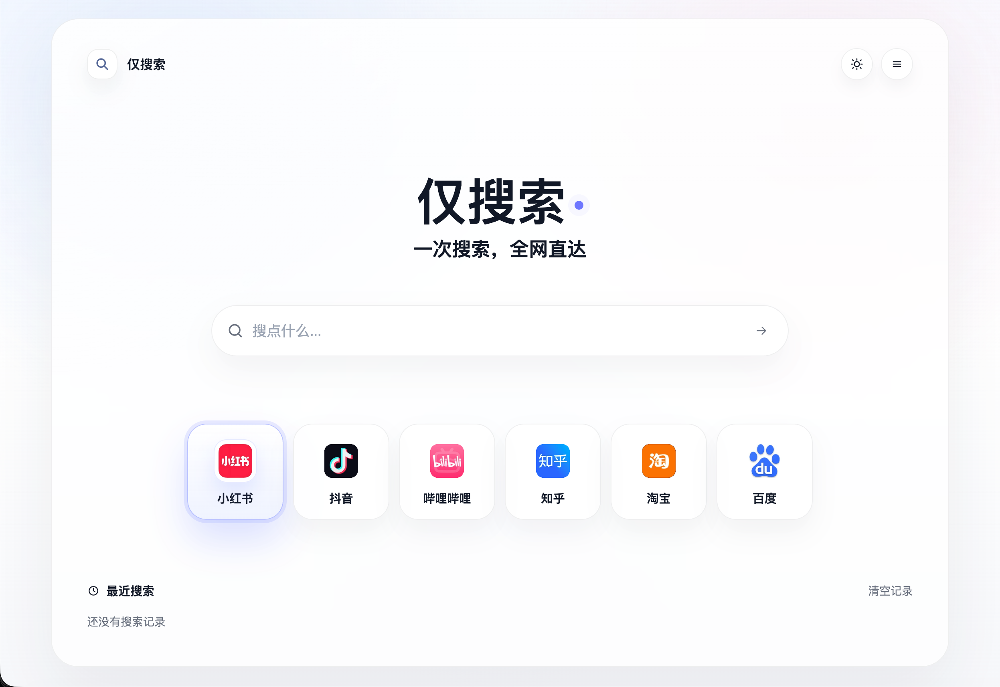
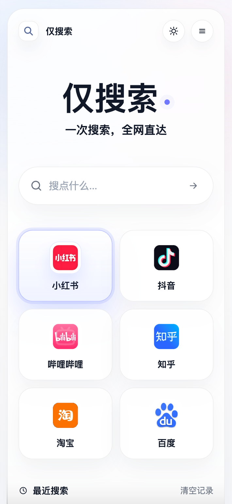

<p align="center">
  
</p>

<h1 align="center">仅搜索</h1>

<p align="center">
  一个轻量、纯静态的聚合搜索首页。一次输入关键词，直达小红书、抖音、哔哩哔哩、知乎、淘宝、百度。
</p>

<p align="center">
  <a href="#为什么做">为什么做</a>
  ·
  <a href="#功能">功能</a>
  ·
  <a href="#截图">截图</a>
  ·
  <a href="#快速使用">快速使用</a>
  ·
  <a href="#搜索来源">搜索来源</a>
</p>

<p align="center">
  
  
  
</p>

## 为什么做

打开小红书、抖音、B 站、微博、快手这类内容平台时，很多时候本来只是想搜索一个东西，但首页推荐流太容易把注意力带走。刷着刷着，反而忘了最开始要找什么。

“仅搜索”想解决的就是这个小痛点：只提供一个干净的搜索入口。你选择目标平台，输入关键词，然后直接跳到对应平台的搜索结果页，尽量绕开首页推荐流。

## 截图

| 桌面端 | 移动端 |
| --- | --- |
|  |  |

## 功能

- 固定 6 个白名单搜索来源：小红书、抖音、哔哩哔哩、知乎、淘宝、百度。
- 输入关键词后，按当前选中的平台生成对应搜索 URL。
- 支持当前页打开和新标签页打开。
- 支持浅色、深色、跟随系统三种主题。
- 自动记住最近一次选择的搜索平台。
- 保存最近搜索记录，可点击历史关键词快速回搜。
- 支持一键清空最近搜索记录。
- 平台 Logo 使用本地 WebP 资源，加载失败时回退到内嵌 SVG。
- localStorage 不可用时自动降级，不影响搜索主流程。
- 桌面端展示六列来源卡片，移动端展示两列来源卡片。
- 支持 `file://` 本地直接打开，也支持 HTTP/HTTPS 静态托管。

## 项目特点

- **纯静态**：只有 HTML、CSS、JavaScript 和本地图片资源。
- **轻量**：`index.html` 约 47 KB，`index.min.html` 约 36 KB。
- **零运行依赖**：不需要 `npm install`，不需要 Node 服务常驻。
- **隐私友好**：没有统计脚本，没有后端上报，历史记录只保存在当前浏览器。
- **白名单跳转**：搜索目标由 `APP_CONFIG` 控制，关键词统一经过 `encodeURIComponent` 编码。
- **可降级**：Logo、localStorage、新标签弹窗被拦截等场景都有回退路径。

## 快速使用

直接打开源码版：

```text
index.html
```

或打开压缩版：

```text
index.min.html
```

页面可以通过本地文件协议直接运行：

```text
file:///.../index.html
```

页面设置和搜索历史保存在当前浏览器的 localStorage 中。换浏览器、清理缓存或使用无痕模式时，历史记录不会同步保留。

## 搜索来源

搜索来源配置在 [index.html](index.html) 的 `APP_CONFIG` 中。

| 平台 | 搜索地址模板 |
| --- | --- |
| 小红书 | `https://www.xiaohongshu.com/search_result?keyword={q}` |
| 抖音 | `https://www.douyin.com/search/{q}` |
| 哔哩哔哩 | `https://search.bilibili.com/all?keyword={q}` |
| 知乎 | `https://www.zhihu.com/search?type=content&q={q}` |
| 淘宝 | `https://s.taobao.com/search?q={q}` |
| 百度 | `https://www.baidu.com/s?wd={q}` |

`{q}` 会被替换为 `encodeURIComponent` 后的关键词。

## 目录结构

```text
.
├── README.md
├── index.html
├── index.min.html
├── assets/
│   ├── logo-baidu.webp
│   ├── logo-bilibili.webp
│   ├── logo-douyin.webp
│   ├── logo-taobao.webp
│   ├── logo-xiaohongshu.webp
│   └── logo-zhihu.webp
├── docs/
│   ├── logo.svg
│   └── screenshots/
│       ├── home-desktop.png
│       └── home-mobile.png
```

## 常见问题

### 为什么不是 Vue / React 项目？

这个项目目标是做一个非常轻的搜索首页。当前功能不需要组件框架、打包器或运行时依赖，纯静态实现更容易部署，也更容易长期维护。

### 可以只上传一个 HTML 文件吗？

不推荐。页面会使用 `assets/` 中的本地 WebP Logo。虽然 Logo 加载失败时有 SVG 回退，但正式使用建议保留 `index.html` 和 `assets/`。

### 可以新增搜索平台吗？

可以。修改 `index.html` 里的 `APP_CONFIG` 和 `LOGO_PNG_SOURCES`。新增平台时应确保搜索 URL 是可信白名单域名，并且使用 `{q}` 作为关键词占位符。

### 为什么保留 `index.min.html`？

`index.min.html` 是和源码版功能一致的压缩产物，体积更小，适合直接分发或部署。

## License

未指定许可证前，默认保留所有权利。公开发布前可按你的实际意愿补充 MIT、Apache-2.0 或其他许可证。
